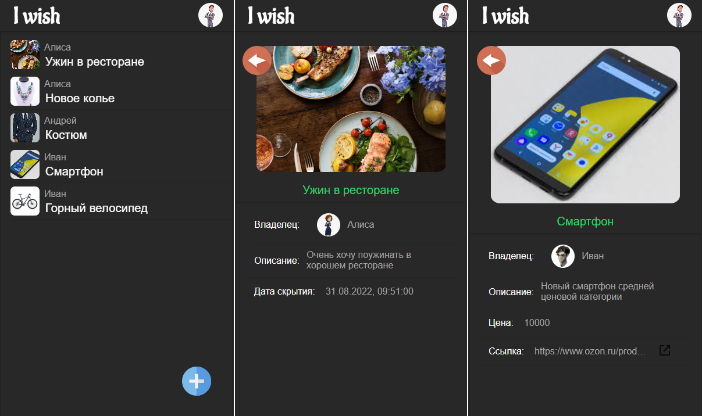
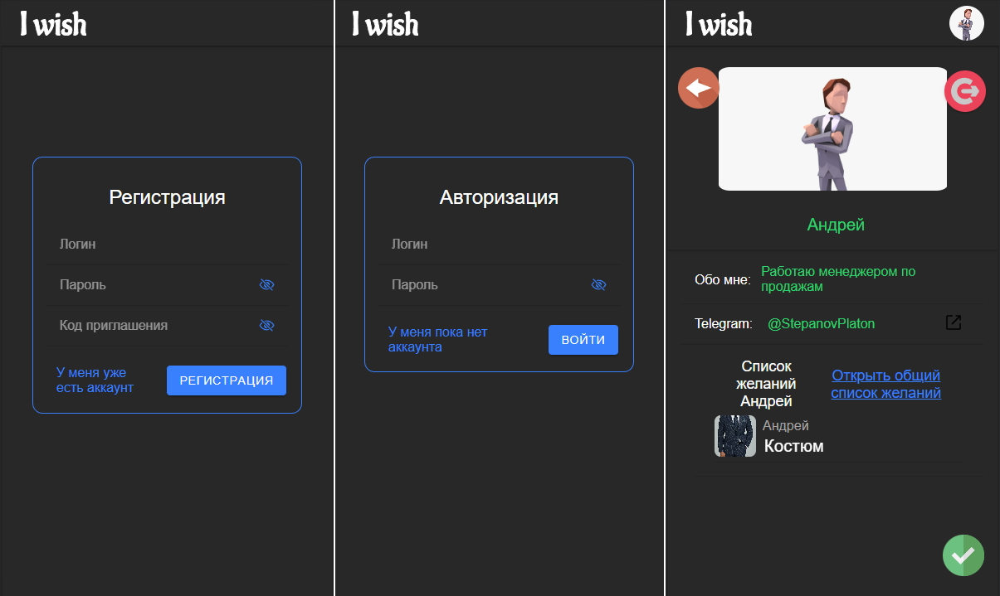
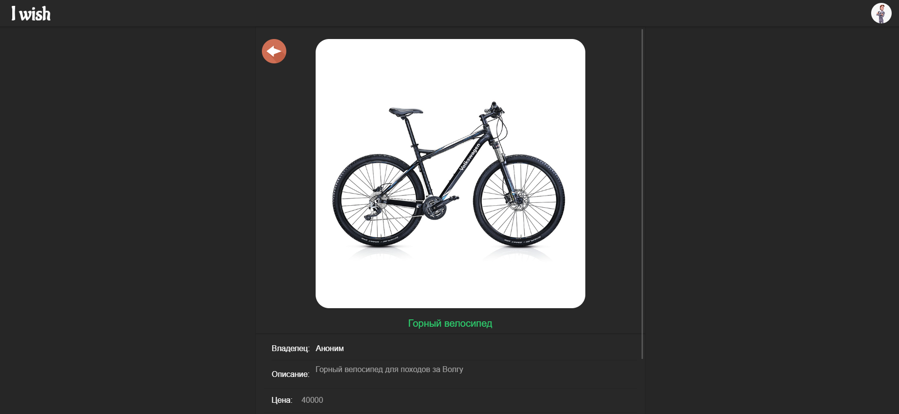
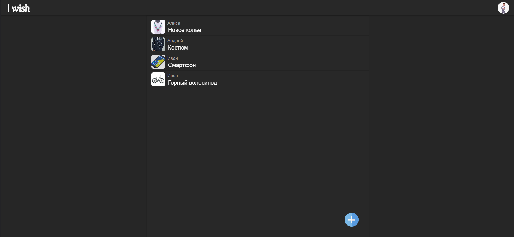

# I wish - приложение для осуществления желаний

I wish - это PWA приложение с адаптивной версткой написанное на Angular и бэкендом на Python, позволяющая пользователям создавать списки своих желаний, что бы другие пользователи знали как их порадовать!

## Стек технологий

#### Frontend

- Angular
- [Ionic](https://ionicframework.com)
- [ngx-translate](http://www.ngx-translate.com)
- [ngx-cookie](https://www.npmjs.com/package/ngx-cookie)

#### Backend

- Python 3.10
- [FastAPI](https://fastapi.tiangolo.com)
- [Databases](https://github.com/encode/databases) (asyncpg/PostgreSQL)

## Запуск

#### Отладка

- Frontent

      cd frontend/i_want
      npm i && npm start

- Backend

      cd backend
      pip3 intall -r requerments.txt
      run.sh (или run.bat для Windows)

#### Docker

    sudo docker-compose build
    sudo docker-compose down -v && sudo docker-compose up -d

## Скриншоты

